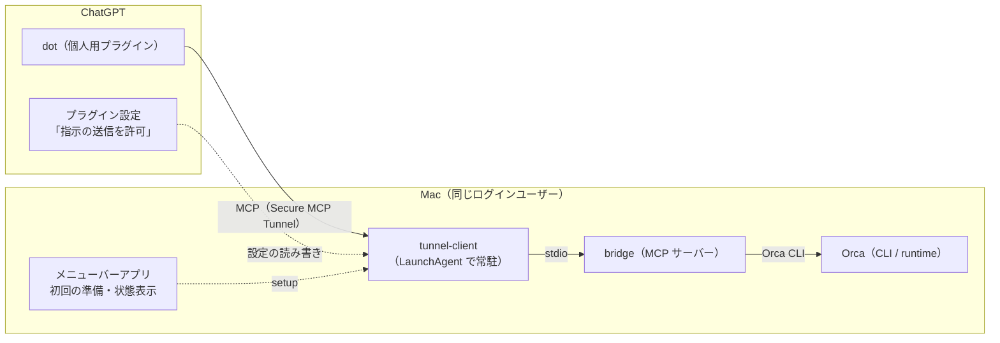

# Orca → dot bridge

[Orca](https://www.onorca.dev) で進めている AI エージェントの作業状態を、ChatGPT の音声アシスタント（dot）から確認し、必要なら指定した1つのエージェントへ追加の指示を送るための bridge です。macOS 専用です。

_A bridge that lets ChatGPT (dot) check the status of agents running in Orca on your Mac, and optionally send one explicit instruction to one agent. macOS only._

| 機能                                              | 状態                                                                                   |
| ------------------------------------------------- | -------------------------------------------------------------------------------------- |
| dot から Orca の状態を確認する                    | 利用可能（Secure MCP Tunnel 経由で実機検証済み）                                       |
| dot から1つのエージェントへ追加の指示を送る       | 利用可能・既定はオフ（ChatGPT のプラグイン設定で許可。実エージェントへの送信は未検証） |
| エージェントのターン終了などを dot へ自動通知する | 実験的（最長10分・1対象の試験のみ。[詳細](docs/architecture.md#自動通知実験的)）       |

## アーキテクチャ



- dot は Secure MCP Tunnel で Mac 上の bridge を呼びます。Tunnel クライアントは Mac から外へ接続するだけで、Mac でポートを開きません。
- bridge が公開するツールは `orca_status`（状態確認）と `orca_send_instruction`（指定した1端末への追加指示）です。送信は、ChatGPT のプラグイン管理画面で「指示の送信を許可」をオンにしたときだけ受け付けます。
- メニューバーアプリは、Tunnel ができる前の初回準備と、Tunnel が動いているかの表示を受け持ちます。設定や許可は ChatGPT 側の画面で行います。

詳しくは[アーキテクチャと実装状況](docs/architecture.md)を参照してください。

## 使い方

必要なもの: macOS、[Orca](https://www.onorca.dev)（CLI を登録済み）、ChatGPT のアカウントと [OpenAI Platform](https://platform.openai.com/) へのアクセス。

1. **アプリを入れる。** [Releases](https://github.com/andoshin11/orca-dots-bridge/releases/latest) から `Orca-Dots-Bridge-<版>-mac-arm64.zip`（Intel Mac は `-mac-x64.zip`）をダウンロードして展開し、「アプリケーション」へ移して開きます。開発者署名をしていないため、初回は「システム設定」→「プライバシーとセキュリティ」で「このまま開く」を選びます。
2. **アプリの画面に沿って準備する（初回だけ）。** 各手順に Platform・ChatGPT の画面のスクリーンショットがあります。
   1. Platform で Tunnel を作り、ID を貼り付ける
   2. Platform で runtime キー（Restricted、Tunnels の Read と Use、期限付き）を作ってコピーする
   3. 「セットアップを実行」を押す（tunnel-client の導入と、ログイン時の自動起動まで行います）
   4. ChatGPT で「カスタム MCP サーバー」を追加する（接続タイプはトンネル、認証なし）
3. **dot から使う。** 「Orca の ○○ の作業はどうなってる？」のように聞きます。指示も送りたい場合は、ChatGPT のプラグイン管理画面で「指示の送信を許可」をオンにします。

runtime キーの期限が近づいたら、新しいキーをコピーしてアプリの「コピーした新しいキーに入れ替える」で入れ替えます。うまく動かないときは[よくあるつまずき](docs/troubleshooting.md)を参照してください。

### CLI で使う

アプリを使わず、ターミナルから状態を確認したり `setup` を実行したりもできます。Releases の `orca-dots-bridge-<版>.tar.gz` を展開すれば、Node.js 22 以上だけで動きます。

```sh
node dist/cli.mjs status --repo <repo> --name <作業名>
pbpaste | node dist/setup.mjs --runtime-key-stdin --status-tunnel-id <Tunnel ID> --install-tunnel-client --install-agent
```

アプリと CLI の `setup` はどちらも同じ状態確認用 Tunnel を設定します。片方だけを使ってください（あとから実行した方の bridge を Tunnel が使います）。

## ドキュメント

| 文書                                                                                                                                | 内容                                                         |
| ----------------------------------------------------------------------------------------------------------------------------------- | ------------------------------------------------------------ |
| [メニューバーアプリ](docs/menu-bar-app.md)                                                                                          | 置き場所、更新、キーの扱い                                   |
| [ChatGPT（dot）から使う](docs/chatgpt-tunnel.md)                                                                                    | `setup` の詳細、プラグイン設定、手作業での Tunnel 構成       |
| [CLI で使う](docs/cli.md)                                                                                                           | CLI のリファレンス、MCP クライアントからの利用、状態の読み方 |
| [アーキテクチャと実装状況](docs/architecture.md)                                                                                    | 通信経路、認証、検証の範囲                                   |
| [自動通知](docs/notifications-design.md)・[relay plugin](docs/relay-notifications.md)・[通知用 Tunnel](docs/notification-tunnel.md) | 実験的な自動通知                                             |
| [開発](docs/development.md)                                                                                                         | ビルド、テスト、リリース                                     |

## ライセンス

[MIT](LICENSE)。第三者のライセンスは [THIRD_PARTY_NOTICES.md](THIRD_PARTY_NOTICES.md) と、配布物の `dist/THIRD_PARTY_LICENSES.md` を参照してください。
