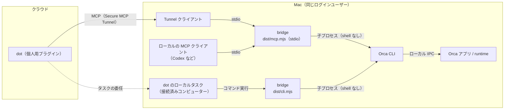
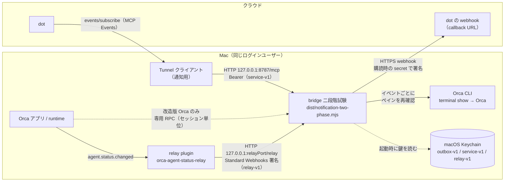

# アーキテクチャと実装状況

bridge・Orca・Tunnel クライアントは、すべて同じ Mac の同じログインユーザーで動かします。Tunnel クライアントは Mac から外へ接続するだけで、Mac 側で外部に向けてポートを開くことはありません。bridge が待ち受けるのは `127.0.0.1` だけです。

## 状態確認と指示の送信

- 公開するツールは、起動時の環境変数で決まります（既定は読み取り 6 つ。`setup` が作る Tunnel では `orca_status` と `orca_send_instruction` の2つで、送信は ChatGPT のプラグイン設定で許可したときだけ受け付けます。手作業の Tunnel 手順では `orca_status` だけ、または同じ2つを公開します）。
- 指示の送信は、確認済みの terminal handle 1 つへの `orca terminal send` 1 回だけです。

## 自動通知（二段階試験）

| 区間                                   | 方式                                                  | 認証・保護                                                                            |
| -------------------------------------- | ----------------------------------------------------- | ------------------------------------------------------------------------------------- |
| dot → bridge（購読）                   | Tunnel → `127.0.0.1:8787/mcp`（MCP Events）           | `Authorization: Bearer`（Keychain の `service-v1`）                                   |
| relay plugin → bridge（ペイン単位）    | `127.0.0.1:<relayPort>/relay`（MCP 用とは別のポート） | Standard Webhooks 署名（`relay-v1`）、時刻 ±5 分、`webhook-id` の再送拒否             |
| 改造版 Orca → bridge（セッション単位） | runtime の専用 RPC（ローカル IPC）                    | runtime token                                                                         |
| bridge → Orca（ペインの再確認）        | Orca CLI の `terminal show`                           | この Mac のユーザー権限                                                               |
| bridge → dot の webhook                | HTTPS（許可したホストのみ、443、リダイレクト不可）    | Standard Webhooks 署名（購読時に dot が渡す secret）、送信待ちは `outbox-v1` で暗号化 |

- 通知は、確認通信 1 回と、private TTY での送信先 URL の確認・承認を経てから始まります。期限は最長 10 分、対象は 1 つです。
- ペイン単位（relay plugin）とセッション単位（改造版 Orca）のどちらか一方を、起動時の設定で選びます。違いは[relay plugin による通知](relay-notifications.md)と[通知実装・検証範囲](notifications-design.md)を参照してください。

## 自動通知（実験的）

状態確認と明示的な指示送信とは別に、ターン終了・入力待ちの自動通知には、次の2つの経路があります。どちらも最大10分・1対象の試験として動きます。

- **セッション単位（`orca.session_activity`）:** 専用RPCを追加したOrcaが必要です。**この公開repoには、そのOrca本体変更も個人用ランチャーも含まれません。** [通知実装・検証範囲](notifications-design.md)と[通知試験のMac mini移行手順](archive/mac-mini-migration.md)に条件をまとめています。
- **ペイン単位（`orca.pane_activity`）:** 通常版のOrcaに、Orca plugin [orca-agent-status-relay](https://github.com/andoshin11/orca-agent-status-relay) を入れて使います。同じペインで始まった別のセッションの区別と、取りこぼしの検出はできません。準備と制約は[relay pluginによる通知](relay-notifications.md)を参照してください。dotへの実通知は未確認です。

## 実装状況

Orca の進捗を音声アシスタントから確認するための、TypeScript 製のブリッジです。概要の読み取りと、明示した1端末への追加指示送信を提供します。CLI とローカル stdio MCP を提供します。接続済みコンピューターのローカルタスク経由で呼び出せます。Secure MCP Tunnelと個人用ChatGPTプラグインを経由するdotからの直接読み取りも検証済みです。その準備（鍵・tunnel-client・profile・LaunchAgentによる常駐）は`setup`コマンド1つで行えます。dotからの指示送信は、ChatGPTのプラグイン管理画面の設定「指示の送信を許可」がオンのときだけ受け付けます（OpenAI MCP Extensionsの`openai/settings`を使用。実エージェントへの送信はまだ行っていません）。音声の往復時間は別途確認してください。[ローカル検証手順](local-validation.md) を同梱しています。

指定セッションのターン終了・入力待ちを扱う通知実装と、最大10分・1対象の二段階試験入口を追加しました。通常版Orcaとrelay pluginで動くペイン単位の経路も追加しました（[relay pluginによる通知](relay-notifications.md)、dotへの実通知は未確認）。2026-10-08の隔離試験ではcallback確認・購読作成・追加承認後のイベント送信1回が成功し、製品側のwebhook起動まで確認しました。イベント種別ごとの実証とdot画面・音声での最終応答は未確認です。試験は終了し、製品側タスクも停止済みです。既存status/sendの接続は変更していません。

[通知実装・検証範囲](notifications-design.md)と[Mac miniへの移行手順](archive/mac-mini-migration.md)を参照してください。通知には専用RPCを追加したOrcaが必要です。このrepoにはOrca本体の変更と個人用ランチャーを含めていないため、cloneだけでは実通知を開始できません。API-keyによる単一サービス主体は今回の限定試験で動作しましたが、本人識別や一般的な製品認証互換性を保証しません。有料Auth0を前提にしていません。[初期のMCP Events調査](archive/mcp-events-compatibility.md)は履歴として残しています。

## 実装と検証

`src/adapter.ts` は固定された4種類のOrca readコマンドと、単一端末へのterminal sendをshellを介さず呼びます。`src/contracts.ts` が `{ok,result}` とネストした `{terminal}` を検証し、`src/normalize.ts` が表示用の状態を変換します。`src/service.ts` は件数・カーソル・鮮度・エラーを扱い、CLI/MCPは同じサービスを使います。

一括送信・再送・再開・停止・削除コマンドは提供しません。既定のMCPは読み取り専用ですが、これはブリッジのAPI制限であり、接続に使用するOrca認証そのものをread-only権限に変えるものではありません。

テストは合成JSON・偽CLI・ローカルTLS受信器を使い、実エージェントや製品の通知先に接続しません。状態変換、壊れた/変化したJSON、ページング、出力制限、未導入CLI、タイムアウト、切断、失敗、ビルド済みCLI、MCP初期化とツール呼び出しを検証します。

参考にした公式資料:

- [Orca CLI reference](https://www.onorca.dev/docs/cli/reference)
- [Worktree contracts](https://github.com/stablyai/orca/blob/main/src/shared/runtime-worktree-contracts.ts)
- [Terminal contracts](https://github.com/stablyai/orca/blob/main/src/shared/runtime-terminal-contracts.ts)
- [CLI send handler](https://github.com/stablyai/orca/blob/main/src/cli/handlers/terminal-send.ts)
- [Vite+ getting started](https://viteplus.dev/guide/)
- [Vite+ pack](https://viteplus.dev/guide/pack)
- [Vite+ test](https://viteplus.dev/guide/test)

上流mainは変化するため、互換性の根拠はドキュメントだけでなくローカル1.4.220の実測JSONです。実データのログや認証情報はfixtureに保存していません。
